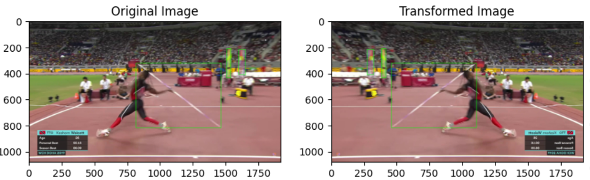
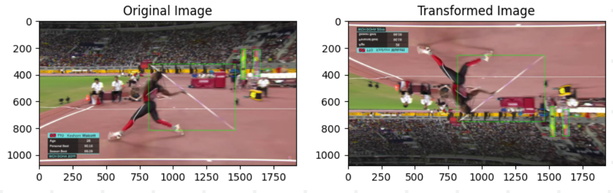
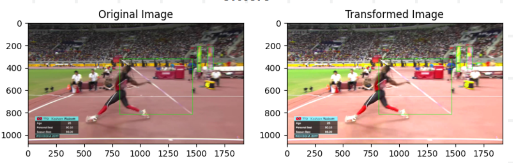
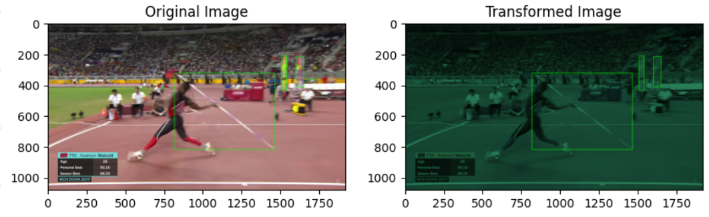
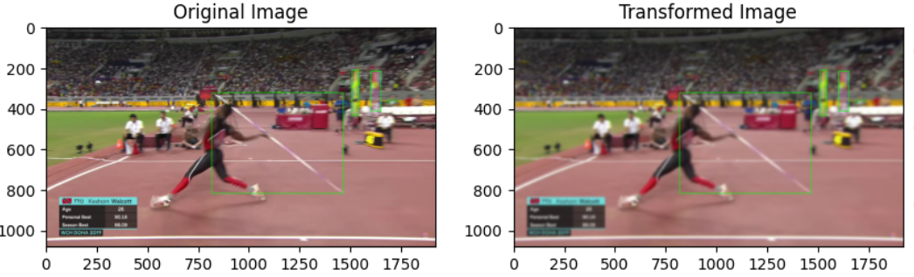
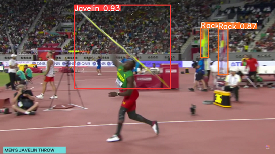

## Introduction

This repository contains the dataset and code used for creating and augmenting a dataset of images annotated with Javelins and racks. The initial dataset was manually created using Label Studio, consisting of 800 images. Data augmentation techniques were applied to increase the dataset size by four times. The augmentation pipeline includes functions such as Horizontal Flip, Vertical Flip, Noise Addition, Scaling, Jittering, Color Alteration, and Blurring. The orientation of label boxes was adjusted accordingly during augmentation.

## Dataset

The initial dataset can be accessed from [here](https://drive.google.com/file/d/1Aua_LE0dlsybzCye1RHBhvpQkHfOH_KX/view?usp=sharing). It contains 800 images annotated with Javelins and racks.

## Data Augmentation

The data augmentation pipeline is implemented in `Dataset_Generator.ipynb`, which is included in this repository. The notebook contains the code for applying various augmentation techniques to the images, along with adjusting the annotations accordingly.
Augmentation Techniques

**Horizontal Flip:** Flips the image horizontally.

**Vertical Flip:** Flips the image vertically.

**Noise Addition:** Adds random noise to the image.

**Jittering:** Applies random jitters to the image.

**Color Alteration:** Changes the color of the image.

**Blur:** Applies blur effect to the image.

## YOLO Model

Then trained YOLO on the augmented dataset and model can accessed from [here](https://drive.google.com/file/d/1QEc2eMhfi-WKVwhhZAETUxegsKjV7xHF/view?usp=sharing).

Result from the YOLO model can be seen in the image below,

