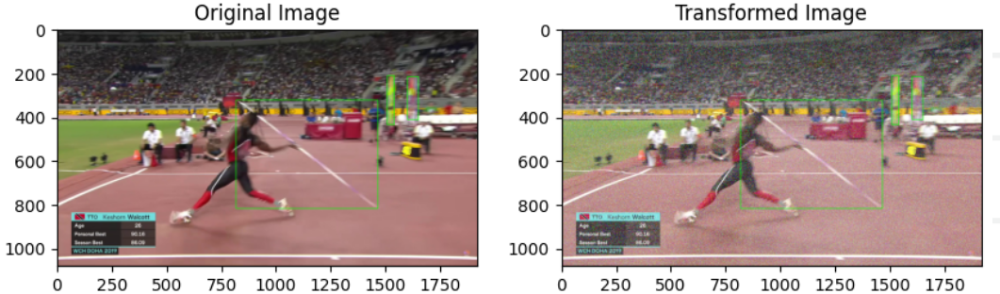

## Introduction

This repository contains the dataset and code used for creating and augmenting a dataset of images annotated with Javelins and racks. The initial dataset was manually created using Label Studio, consisting of 800 images. Data augmentation techniques were applied to increase the dataset size by four times. The augmentation pipeline includes functions such as Horizontal Flip, Vertical Flip, Noise Addition, Scaling, Jittering, Color Alteration, and Blurring. The orientation of label boxes was adjusted accordingly during augmentation. This repository also contains video snipping file which snips the useful part of the video automatically to generate the video dataset which can be used for throw predictions. This repository also contains the initially calculated throw features from the video itself.

## Dataset

The initial dataset can be accessed from [here](https://drive.google.com/file/d/1Aua_LE0dlsybzCye1RHBhvpQkHfOH_KX/view?usp=sharing). It contains 800 images annotated with Javelins and racks.

## Data Augmentation

The data augmentation pipeline is implemented in `Dataset_Generator.ipynb`, which is included in this repository. The notebook contains the code for applying various augmentation techniques to the images, along with adjusting the annotations accordingly.

### Augmentation Techniques:

**Horizontal Flip:** Flips the image horizontally.

**Vertical Flip:** Flips the image vertically.

**Noise Addition:** Adds random noise to the image.

**Jittering:** Applies random jitters to the image.

**Color Alteration:** Changes the color of the image.

**Blur:** Applies blur effect to the image.

## YOLO Model

Then trained YOLO on the augmented dataset and model can accessed from [here](https://drive.google.com/file/d/1QEc2eMhfi-WKVwhhZAETUxegsKjV7xHF/view?usp=sharing).

Result from the YOLO model can be seen in the image below,

## Feature calculations

For the initial run below features were calculated:

**Velocity of the Javelin:** The velocity of the Javelin was calculated by determining the change in the position of the bottom-left corner point of the javelin's bounding box between two consecutive frames just before release. This change in position was divided by the time difference between the two consecutive frames.

**Height of release:** The height of realese was calculated by determining the distance between bottom of the thrower's bounding box and middle part of the javelin's bounding box.

**Distance from the foul line** It was calculated via manually creating a line (red line as showen in the image above) using OpenCV at the foul line at the point of release and calculating the distance between that line and the midlle portion of the thrower's bounding box.

**Javelin's angle:** It was calculated by determining the angle between diagonal and bottom of the javelin's bounding box.

**Angle of Velocity:** It was calculated by determining the angle between the velocity of javelin and bottom of the javelin's bounding box.

Pixel coordinates were converted to SI units (meter) by first calculating the length of the Javelin in pixel coordinates in the frame where the whole javelin is present. This was achieved by calculating the length of the diagonal of the javelin's bounding box. Knowing the actual length of the javelin being used in meters, a ratio of pixel to meters in the video frames was obtained. This ratio was then used to convert pixelated units to SI units (meter).

Initially calculated features can be accessed from [here](./Initially_generated_features.csv)
